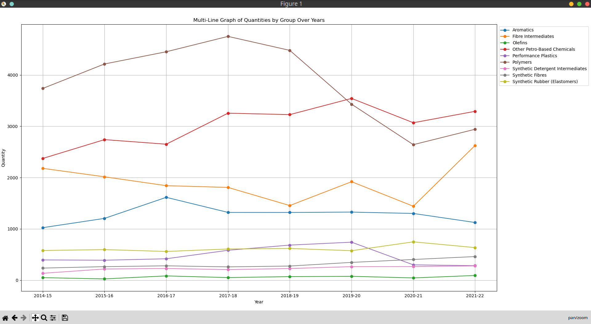
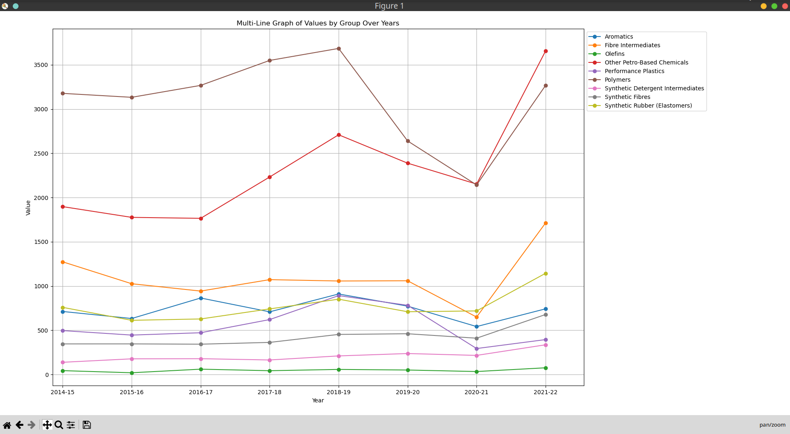

**Data Information**  
- The data is in CSV file format and is obtained from the [Government of India](https://www.data.gov.in/resource/imports-major-petrochemical-product-wise-group-wise-2014-15-2021-22).  
- The data size has been reduced using the script [data_grouping.py](data_grouping.py), which calculates the total quantity and value for each group for the given years.  
- Quantities are represented in 103 Metric Tons (original quantities were in Metric Tons, scaled down for easier calculations).  
- Values are represented in 103 Lakhs (original values were in Lakhs, scaled down for easier calculations).  
- Plots are created for:
  - **Quantity vs Year**
  - **Value vs Year**  

**Y-Scale Information**  
- For quantities: 1 unit on the Y-axis represents 103 Metric Tons.  
- For values: 1 unit on the Y-axis represents 1 Crore.  

**Plots**  
- **Quantity vs Year Plot**  
    

- **Value vs Year Plot**  
    
  